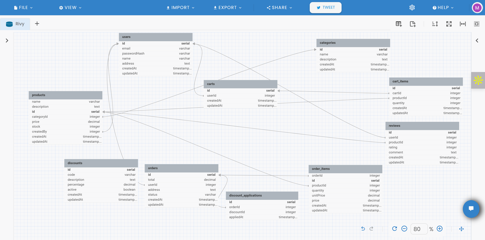

# Rivy Storefront — Monorepo

Welcome to the Rivy Storefront project! This monorepo is designed to be a robust, scalable, and approachable e-commerce platform, built for both technical and non-technical users. Whether you are a developer, product manager, or business stakeholder, this documentation will guide you through the architecture, features, and workflows of the project.

---

## Table of Contents

1. [Project Overview](#project-overview)
2. [Getting Started](#getting-started)
3. [Architecture & Technologies](#architecture--technologies)
4. [Entity Relationship Diagram](#entity-relationship-diagram) 
5. [API Documentation](#api-documentation)
6. [Testing & Quality](#testing--quality)
7. [Workflows & Branching](#workflows--branching)
8. [Completed Tasks](#completed-tasks)
9. [Future Improvements](#future-improvements)
10. [Contributing](#contributing)
11. [Contact & Support](#contact--support)

---


## Project Overview

Rivy Storefront is a modern e-commerce platform featuring:

- **Frontend:** React 18, TypeScript, Zustand, React Query, Tailwind CSS
- **Backend:** Node.js, Express, Sequelize ORM, PostgreSQL
- **DevOps:** Docker Compose, CI/CD, Conventional Commits
- **Testing:** Jest, Vitest

---

## Getting Started

### Prerequisites
- Docker & Docker Compose
- Node.js (v18+ recommended)
- npm

### Setup Instructions
1. **Clone the repository:**
	```bash
	git clone https://github.com/Muhadev/rivy-storefront-monorepo.git
	cd rivy-storefront-monorepo
	```
2. **Copy environment files:**
	```bash
	cp apps/backend/.env.example apps/backend/.env
	cp apps/frontend/.env.example apps/frontend/.env
	```
3. ## Start all services (root compose)

	You can spin up both the backend and frontend services using the provided scripts.  
	Choose the appropriate script for your operating system.

	---

	### For Windows Users
	Run the file to start both backend and frontend services:

	```bash
	cd rivy-storefront-monorepo
	up.bat
	```
	

	To bring everything down:

	```bash
	cd rivy-storefront-monorepo
	down.bat
	```
	---

	### For Linux / macOS Users
	Run the file to start both backend and frontend services:

	```bash
	Make sure you on the root of the folder before running the commmand below
	chmod +x up.sh
	./up.sh
	```
	

	To bring everything down:

	```bash
	Make sure you on the root of the folder before running the commmand below
	chmod +x down.sh
	./down.sh
	```
	---


4. **Start frontend and backend only (with nginx, db):**
	```bash
	cd apps/backend
	docker compose up --build
	```

	```bash
	cd apps/frontend
	docker compose up --build
	```
	

**Access Points:**
- API: [http://localhost:4001/api](http://localhost:4001/api)
- OpenAPI Docs: [http://localhost:4001/api/v1/docs](http://localhost:4001/api/v1/docs)
- Frontend: [http://localhost:3000](http://localhost:3000)

---

### Why a Monorepo?

> **Note:** This project is intentionally structured as a single repository (monorepo) for both frontend and backend. While separating frontend and backend into distinct repositories is considered best practice for production systems, a monorepo was chosen here to make navigation easier for reviewers and assessment stakeholders. This approach allows for:
> - Faster onboarding and review (all code in one place)
> - Simpler local setup and Docker orchestration
> - Easier cross-referencing between frontend and backend features
> - Streamlined CI/CD and documentation

---

### Why Use Image URLs for Products?

> **Note:** Product images are referenced by URL rather than uploaded and stored. This is because the project is deployed on a free hosting platform, which does not persist uploaded files after a refresh or redeploy. Using image URLs ensures that product images remain available and visible to users and reviewers. For production, a dedicated file storage solution (e.g., AWS S3, Cloudinary) would be recommended.

---

### Other Trade-offs & Decisions

- **Minimal dependencies:** Only essential libraries are used to keep the project lightweight and easy to audit.
- **Simple authentication:** Admin actions are protected by basic authentication; no OAuth or advanced RBAC for simplicity.
- **No payment gateway:** Payment is simulated to focus on core e-commerce logic and avoid integration complexity.
- **Free-tier hosting:** Some features (e.g., persistent file uploads, advanced analytics) are omitted due to platform limitations.
- **Wireframes and design:** Mid-fidelity wireframes are provided for clarity, but not pixel-perfect UI.

---

## Assessment Context

### Full-Stack Engineer Assessment

#### Overview

Welcome to the Full-Stack Technical Assessment! You're working at a fintech company that sells solar equipment and finances customer purchases through installment loans. This assessment evaluates your ability to audit an existing storefront, propose improvements, implement a production-minded full stack solution, and communicate insights effectively.

**Reference storefront:**
[energystack.staging.rivy.co](http://energystack.staging.rivy.co)

####  What to build

##### Part 1: Quick audit and redesign plan
1. Review the current storefront.
2. Write a short critique that covers information architecture, UX, accessibility, performance, and mobile experience.
3. Mid fidelity wireframes are fine. Keep it concise.

##### Part 2: Implement a minimal storefront
1. **Catalog**
	- List products with pagination and text search
	- Filter by category and price range
2. **Product detail**
	- Show images, description, price, stock
	- Add to cart
3. **Cart and checkout summary**
	- View items, update quantity, remove item
	- Compute totals and a simple tax or fee rule
	- Simulate checkout and create an order record
	- Show an order confirmation screen
4. **Orders**
	- Persist orders and order items
	- Mark order as placed and expose a read endpoint

##### Tech Stack
- ReactJs
- Node
- Postgres (`Sequelize ORM`)
- Typescript

##### Backend
1. REST API that covers all features above.
2. Input validation on all write endpoints.
3. Consistent error format.
4. Basic rate limiting and CORS.
5. OpenAPI documentation that is accessible from the repo or a hosted page.
6. Meaningful logs for request start, success, and error.
7. Unit tests for core logic and at least one handler. An integration test for add to cart and checkout is a plus.

##### Frontend
1. React with TypeScript is recommended.
2. Mobile first and responsive.
3. Clear loading, empty, and error states.
4. Accessible forms and controls with keyboard focus handling.
5. Clean component structure.
6. A small test suite is a plus.

##### Payment
- Simulate payment only. No gateway integration is required.

##### Documentation README must include:
1. Overview and tech choices
2. How to run locally with docker compose
3. Environment variables and seeding steps
4. How to run tests
5. Deployed URL
6. Link to API docs
7. Known trade offs and future improvements

##### Deliverables
1. Public Git repository
2. Live product URL
3. Wireframe link for the screens

##### Evaluation:
1. Correctness of features and API behavior
2. Code quality and structure with strong typing or equivalent rigor
3. Database Modeling, and Query Optimization
4. Tests that cover important logic
5. UX clarity, performance, and accessibility basics
6. Documentation and ease of setup
7. Deployment reliability and environment configuration
8. Thoughtful trade offs noted in the README

##### Optional improvements that can help you stand out
1. Simple authentication for admin actions
2. Discount codes and price rules
3. Inventory reservation during checkout simulation
4. Image optimization and lazy loading
5. Basic analytics events such as page views and add to cart

##### Submission Instructions

###### Submission Requirements
1. **Time Limit**: One week from receipt, due by 18:00 `WAT`
2. **Format**: 
	 - Repo URL
	 - Live product URL
	 - Wireframe Link
3. **Submission method**
	 - [Link](https://www.notion.so/2473ed81d14180229b98d869da03e3ef?pvs=21)

---

## API Documentation

- The OpenAPI spec is available at `/api/v1/docs` (YAML format)
- See `apps/backend/openapi.yaml` for endpoint details
- Postman collection: [`apps/backend/postman/rivy-storefront-api.postman_collection.json`](apps/backend/postman/rivy-storefront-api.postman_collection.json)
- Hosted Postman docs: [https://documenter.getpostman.com/view/26323710/2sB3BHkoKt](https://documenter.getpostman.com/view/26323710/2sB3BHkoKt)

---

## Architecture & Technologies

**Frontend:**
- Built with React and TypeScript for reliability and maintainability
- State management via Zustand and React Query
- UI styled with Tailwind CSS
- Modular structure for features, components, hooks, and pages

**Backend:**
- Express.js REST API
- Sequelize ORM for PostgreSQL
- Modular controllers, services, repositories, and models
- Robust validation and error handling

**DevOps:**
- Docker Compose for local development and deployment
- Environment-based configuration
- Health checks and service orchestration

---

## Entity Relationship Diagram



The ER diagram above illustrates the relationships between core entities: Users, Products, Orders, Cart, Reviews, and Discounts.

---

## API Documentation

- The OpenAPI spec is available at `/api/v1/docs` (YAML format)
- See `apps/backend/openapi.yaml` for endpoint details
- Postman collection: `apps/backend/postman/rivy-storefront-api.postman_collection.json`

---

## Testing & Quality

**Backend:**
- Run backend tests:
  ```bash
  npm -w apps/backend test
  ```

**Frontend:**
- Run frontend tests:
  ```bash
  npm -w apps/frontend test
  ```

**Linting & Formatting:**
- ESLint and Prettier are configured for both frontend and backend

---

## Workflows & Branching

- **Default branch:** `main`. Daily work targets `dev`. Create PRs from `dev` → `main` only after a feature is fully completed.
- **Commit style:** Conventional Commits (`feat:`, `fix:`, `chore:`, `refactor:`...)
- **Feature workflow:** One commit per sub-feature (e.g., `feat(auth): setup user model & env`, then `feat(auth): login controller/service/routes`)
- **CI/CD:** Automated tests and builds on PRs

See `docs/COMMIT_PLAN.md` and `docs/ROADMAP.md` for more details.

---

## Completed Tasks

- Project scaffolding for frontend and backend
- Docker Compose setup for local development
- User authentication (register, login, profile)
- Product catalog CRUD (admin only)
- Cart management (add, update, remove, clear)
- Checkout and order processing
- Review and rating system
- Discount and promotion management
- Admin dashboard with summary stats
- Pagination and search for products and customers
- Role-based access control (admin/customer)
- Health checks and service orchestration
- API documentation (OpenAPI, Postman)
- Unit and integration tests
- CI/CD pipeline

---

## Future Improvements

- Add payment gateway integration
- Implement advanced analytics for admin dashboard
- Improve mobile responsiveness and accessibility
- Add multi-language support
- Enhance security (rate limiting, audit logs)
- Expand test coverage (frontend e2e, backend integration)
- Add email notifications for orders and reviews
- Integrate with third-party shipping APIs
- Support for product variants and inventory management
- Real-time order tracking

---

## Contributing

We welcome contributions from developers, designers, and product managers. Please read our [CONTRIBUTING.md](docs/CONTRIBUTING.md) for guidelines.

---

## Contact & Support

- For questions, issues, or feature requests, open an issue on GitHub or contact the maintainer at [muhammedfayemi@gmail.com](mailto:muhammedfayemi@gmail.com).

---

_This project is maintained with a focus on clarity, reliability, and extensibility. If you have feedback or suggestions, please reach out!_
